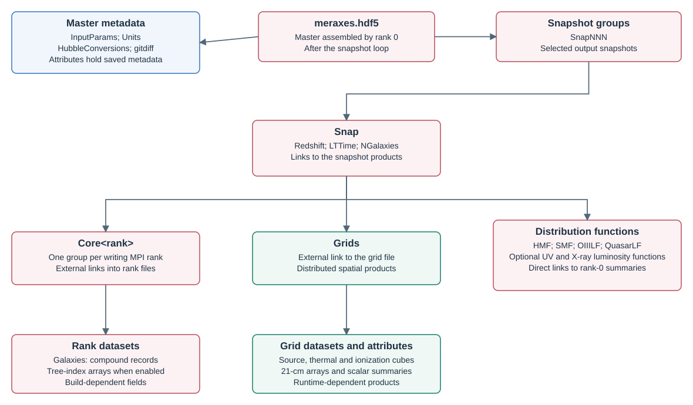

# Outputs

Meraxes saves galaxy catalogues, radiation grids, and global statistics in HDF5 files. Open the master file to access these products through a single hierarchy.



## Files and snapshots

For example, set the output directory and filename prefix in `input.par`:

```text
OutputDir:         ./output/
FileNameGalaxies:   meraxes
```

For a selected output at snapshot 10, the files are:

| File | Contents |
| --- | --- |
| `output/meraxes.hdf5` | Master metadata and links to selected snapshots; assembled by rank 0 after the run. |
| `output/meraxes_0.hdf5`, `output/meraxes_1.hdf5`, … | One catalogue file per MPI rank, containing galaxy records and merger indices. Rank 0 also holds global distribution functions. |
| `output/meraxes_grids_10.hdf5` | Snapshot 10 source, ionization, thermal, 21-cm, and optional LW products; written collectively. |
| `output/meraxes_metal_grids_10.hdf5` | Snapshot 10 metal-enrichment grids when mini-halo and metal-evolution physics are enabled. |

The corresponding group in `meraxes.hdf5` is `Snap010`. For example,
`Snap010/Core0/Galaxies` opens `Snap010/Galaxies` in `meraxes_0.hdf5`, while
`Snap010/Grids/xH` opens `/xH` in `meraxes_grids_10.hdf5`.
Keep the files together so these relative external links remain valid.
The master links selected output snapshots; intermediate grid files may also hold global summaries.

| Inside `Snap` | Object | Contents |
| --- | --- | --- |
| `CoreN` | Group | Links to rank N's `Galaxies` and merger-index datasets. |
| `Grids` | External group link | Radiation-grid file, including the `stars` source dataset. |
| `MetalGrids` | External group link | Optional metal-grid file. |
| `HMF`, `SMF`, luminosity functions | External dataset links | Global distributions stored in the rank-0 file. |
| Attributes | Snapshot metadata | `NGalaxies`, `Redshift`, `LTTime`. |

### Metadata and units

| Location | Information |
| --- | --- |
| Root attributes | `NCores`; rank files also store `iCore`. |
| `InputParams` attributes | Effective run parameters, including the determined `EndSnapshotLightcone` when applicable. |
| `Units` attributes | Galaxy-field unit strings. |
| `HubbleConversions` attributes | Galaxy-field h conversions: `v/h`, `v*(h**2)`, `v`, or `None`. |
| `Units/Grids`, `HubbleConversions/Grids` | Grid units and h conversions. |
| `Units/MetalGrids` | Metal-grid units; no separate h-conversion registry. |
| `gitdiff` and its `gitref` attribute | Build revision and source changes, when recorded. |
| `Snap` attributes | `NGalaxies`: total saved rows; `Redshift`: snapshot redshift; `LTTime`: lookback time in Myr/h under the standard units. |

Tables below use the standard simulation units. Masses labelled `10¹⁰ Msun/h` require multiplication by 10¹⁰ and division by `Hubble_h`; `Sfr` is already in Msun/yr. Positions are comoving, while virial and disk radii are physical. Raw `h5py` reads retain all h factors. A dash denotes dimensionless values or identifiers. Numeric attributes are commonly one-element arrays.

**Mini-halo notation.** `(III)` marks an additional Pop III quantity enabled by `USE_MINI_HALOS` (`Mini`): `stars(III)` means `stars` and `starsIII`, and `Fesc(III)WeightedSfr` means `FescWeightedSfr` and `FescIIIWeightedSfr`. Parentheses are not literal. `(II)` also requires Mini, but identifies the radiation/thermal channel **without Pop III sources**, retaining AGN contributions and the model's ionization field.

### What is saved

| Product | Output condition |
| --- | --- |
| Galaxy catalogue and merger indices | Selected snapshot, ordinary output mode; omitted for `FlagInteractive = 2`. |
| Enabled distributions | Selected snapshot; also available in summary-only mode. |
| Source and density cubes | Selected snapshot during ionization (`Flag_OutputGrids`) or thermal evolution (`Flag_IncludeSpinTemp`, independent of `Flag_OutputGrids`). |
| Ionization, thermal, 21-cm and LW products | Selected snapshot with `Flag_PatchyReion` and `Flag_OutputGrids` while reionization or lightcone evolution is active. `Flag_OutputGridsPostReion` extends output after reionization. |
| Global grid summaries | May be written without cubes, using empty datasets of shape `(0,)` to hold attributes. |

`FlagMCMC` uses a separate output workflow. Check a grid's shape before treating it as a cube; empty attribute holders still contain useful global histories.

## Galaxy catalogues

`Snap/CoreN/Galaxies` is a one-dimensional compound table. Each row represents a galaxy with `Type < 3`, including eligible ghosts and galaxies with zero stellar mass. Indices refer to rows within that rank.

All scalar real fields below are float32; integer fields and array shapes are shown explicitly. `H` denotes `N_HISTORY_SNAPS`, and `B` denotes `MAGS_N_BANDS`. Read their actual lengths from the dataset dtype. The table is chunked and compressed.

### Identity and halo properties

| Field | Type | Meaning | Unit |
| --- | --- | --- | --- |
| `HaloID` | int64 | Host/subhalo identifier; −1 for ghosts. | — |
| `ID` | int64 | Galaxy identifier. | — |
| `Type` | int32 | 0: central; 1: resolved satellite; 2: orphan. | — |
| `CentralGal` | int32 | Rank-local central-galaxy row; −1 for ghosts. | — |
| `GhostFlag` | int32 | Galaxy carried across a missing/skipped halo. | — |
| `Galaxy_Population` | int32 | 2: Pop II; 3: Pop III. Mini. | — |
| `Len` | int32 | Current or retained subhalo particle count. | — |
| `MaxLen` | int32 | Largest historical subhalo particle count. | — |
| `Pos` | float32[3] | Comoving position; orphans retain their last resolved position. | cMpc/h |
| `Vel` | float32[3] | Galaxy/halo velocity. | km/s |
| `Spin` | float32 | Halo spin parameter. | — |
| `Mvir` | float32 | Current or retained subhalo virial mass. | 10¹⁰ Msun/h |
| `Rvir` | float32 | Physical virial radius. | Mpc/h |
| `Vvir` | float32 | Virial velocity. | km/s |
| `Vmax` | float32 | Maximum circular velocity. | km/s |
| `FOFMvir` | float32 | Parent FOF mass; −1 for ghosts. | 10¹⁰ Msun/h |
| `FOFMvirModifier` | float32 | FOF-mass correction factor. | — |
| `MergTime` | float32 | Remaining orphan merger time. | Myr/h |
| `MergerStartRadius` | float32 | Initial orbital separation relative to central virial radius. | Ratio; see unit notes below |
| `dt` | float32 | Evolution timestep. | Myr/h |

### Gas and stars

| Field | Type | Meaning | Unit |
| --- | --- | --- | --- |
| `HotGas` | float32 | Hot gas mass. | 10¹⁰ Msun/h |
| `MetalsHotGas` | float32 | Metal mass in hot gas. | 10¹⁰ Msun/h |
| `ColdGas` | float32 | Cold gas mass. | 10¹⁰ Msun/h |
| `MetalsColdGas` | float32 | Metal mass in cold gas. | 10¹⁰ Msun/h |
| `H2Frac` | float32 | Molecular fraction; central fraction in the pressure-law prescription. | — |
| `H2Mass` | float32 | Molecular gas mass. | 10¹⁰ Msun/h |
| `HIMass` | float32 | Atomic gas mass. | 10¹⁰ Msun/h |
| `Mcool` | float32 | Cooling mass accumulated during the snapshot. | 10¹⁰ Msun/h |
| `Rcool` | float32 | Latest cooling radius. | Mpc/h |
| `DiskScaleLength` | float32 | Physical disk scale length. | Mpc/h |
| `EjectedGas` | float32 | Ejected gas awaiting reincorporation. | 10¹⁰ Msun/h |
| `MetalsEjectedGas` | float32 | Metal mass in ejected gas. | 10¹⁰ Msun/h |
| `BaryonFracModifier` | float32 | Suppression factor applied to baryon infall. | — |
| `MvirCrit` | float32 | Local UV-background critical halo mass. | 10¹⁰ Msun/h |
| `MvirCrit_MC` | float32 | Molecular-cooling critical mass. Mini. | 10¹⁰ Msun/h |
| `StellarMass` | float32 | Surviving stellar mass after recycling. | 10¹⁰ Msun/h |
| `Pop2StellarMass`, `Pop3StellarMass` | float32 | Surviving Pop II and Pop III stellar masses. Mini. | 10¹⁰ Msun/h |
| `RemnantMass` | float32 | Stellar remnant mass. Mini. | 10¹⁰ Msun/h |
| `GrossStellarMass(III)` | float32 | Total formed stellar mass before recycling. | 10¹⁰ Msun/h |
| `MetalsStellarMass` | float32 | Stellar metal-mass bookkeeping. | 10¹⁰ Msun/h |
| `Sfr` | float32 | Snapshot star-formation rate. | Msun/yr |
| `NewStars` | float32[H] | Formed stellar mass per snapshot; index 0 is most recent. | 10¹⁰ Msun/h |
| `NewStarsPop2`, `NewStarsPop3` | float32[H] | Pop II and Pop III formation histories, newest first. Mini. | 10¹⁰ Msun/h |
| `MergerBurstMass` | float32 | Cumulative mass formed in merger bursts. | 10¹⁰ Msun/h |
| `MWMSA` | float32 | Mass-weighted mean stellar age. | See unit notes below |
| `Fesc(III)` | float32 | Untreated stellar ionizing escape fraction. | — |
| `Fesc(III)WeightedSfr` | float32 | Untreated escape-weighted stellar SFR. | Msun/yr |
| `Fesc(III)WeightedGSM` | float32 | Cumulative untreated escape-weighted formed stellar mass. | 10¹⁰ Msun/h |
| `tau_cgm` | float32 | CGM optical-depth term for escape suppression. | — |
| `Cos_Inc` | float32 | Cosine of disk inclination used for attenuation. | — |
| `LOIII` | float32 | Intrinsic [O III] luminosity. | 10⁴⁰ erg/s |
| `ionization_param` | float32 | Line-emission parameter q. | cm/s |

`Metals*` fields contain metal masses, rather than metallicity ratios. `Fesc`, `FescWeightedSfr`, and `FescWeightedGSM` retain untreated values; stochastic source grids use separate accumulators and may be recalibrated during [source deposition](workflow.md#radiation-and-feedback).

### Black holes and AGN

| Field | Type | Meaning | Unit |
| --- | --- | --- | --- |
| `BlackHoleMass` | float32 | Black-hole mass. | 10¹⁰ Msun/h |
| `BlackHoleAccretedHotMass` | float32 | Snapshot hot-mode accreted mass. | 10¹⁰ Msun/h |
| `BlackHoleAccretedColdMass` | float32 | Snapshot cold-mode accreted mass. | 10¹⁰ Msun/h |
| `FescBH` | float32 | AGN ionizing escape fraction. | — |
| `BHemissivity` | float32 | Effective AGN ionizing source rate. | See unit notes below |
| `EffectiveBHM` | float32 | Cumulative AGN budget in equivalent stellar-source mass. | 10¹⁰ Msun/h |
| `QuasarMag` | float32 | Intrinsic absolute magnitude at 1450 Å; 999.9 if no UV luminosity. | AB mag |
| `QuasarLX` | float32 | Intrinsic 2–10 keV luminosity. | 10¹⁰ Lsun |
| `BHXrayEmissivity` | float32 | Obscured/observed 2–10 keV luminosity. | 10¹⁰ Lsun |
| `NHbin` | int32 | Column-density bin 0–4: log NH intervals 20–21, 21–22, 22–23, 23–24, 24–26; −1: no AGN. | Index; NH in cm⁻² |
| `DutyCycleAGN` | float32 | AGN active fraction, bounded between 0 and 1. | — |

### Enrichment and photometry

Mini adds the following enrichment quantities.

| Field | Type | Meaning | Unit |
| --- | --- | --- | --- |
| `Flag_ExtMetEnr` | int32 | External enrichment flag. | — |
| `RmetalBubble` | float32 | Physical metal-bubble radius. | Mpc/h |
| `MetalProbability` | float32 | Local grid enrichment probability. | — |
| `GalMetalProbability` | float32 | Per-galaxy random variate compared with enrichment probability. | [0, 1) |

`CALC_MAGS` adds photometry at configured target snapshots, in the configured band order.

| Field | Type | Meaning | Unit |
| --- | --- | --- | --- |
| `LOIII_dusty` | float32 | Attenuated [O III] luminosity; initially intrinsic if no suitable rest-band attenuation exists. | 10⁴⁰ erg/s |
| `Mags(III)` | float32[B] | Intrinsic magnitudes. | mag |
| `DustyMags` | float32[B] | Dust-attenuated magnitudes. | mag |

### Unit notes

| Field | Reading convention |
| --- | --- |
| `MergerStartRadius` | Stored dimensionless radius ratio; ignore its legacy `Mpc`, `v/h` metadata. |
| `MWMSA` | Stored in internal time units despite `Myr` metadata; apply the run's time-unit conversion before removing h. |
| `BHemissivity` | Effective rate after equivalent-mass, duty-cycle, and response treatment; the legacy `1e60 photons` label does not describe a photon count. |

### Merger indices

| Dataset under `CoreN` | Length | Meaning |
| --- | --- | --- |
| `FirstProgenitorIndices` | Current galaxy count | First progenitor's row in the preceding snapshot. |
| `DescendantIndices` | Previous galaxy count | Descendant's row in the following snapshot. |
| `NextProgenitorIndices` | Previous galaxy count | Next row in the progenitor list sharing a descendant. |

These integer arrays use rank-local rows, with −1 for missing connections. Links are generated only for adjacent simulation snapshots that are both saved. The latter two arrays are added retrospectively to the earlier snapshot; the final output normally lacks them. Preserve rank offsets when concatenating catalogues.

## Radiation grids

All datasets in this section are under the snapshot's `Grids` group in the master file and at the root of its grid file. In the example above, `Snap010/Grids/xH` links to `/xH` in `output/meraxes_grids_10.hdf5`. Source grids, thermal fields, 21-cm lightcones and power spectra, and LW diagnostics use the same location.

A full field is a float32 cube with `ReionGridDim` cells per axis. Cubes are uncompressed, chunked by x plane, and occupy four bytes per cell. Lightcones, power spectra, and spectral diagnostics have the alternative shapes listed below.

| Abbreviation | Configuration |
| --- | --- |
| BH | `physics.Flag_BHFeedback` |
| Rec | `Flag_IncludeRecombinations` |
| UVB | `ReionUVBFlag` enabled |
| Spin | `Flag_IncludeSpinTemp` |
| Bright | `Flag_Compute21cmBrightTemp` |
| LC / PS | `Flag_ConstructLightcone` / `Flag_ComputePS` |
| Mini / LW | `USE_MINI_HALOS` / `Flag_IncludeLymanWerner` |

### Source grids

| Dataset | Meaning | Additional condition | Unit |
| --- | --- | --- | --- |
| `deltax` | Simulation density contrast. | — | — |
| `stars(III)` | Cell sum of cumulative escaped stellar-source mass, including enabled stochastic treatment and recalibration. | — | 10¹⁰ Msun/h |
| `weighted_sfr(III)` | Cell sum of escape-weighted stellar SFR. | — | Msun/yr |
| `effective_bhm` | Cumulative AGN budget in equivalent stellar-source mass; only BHs above `BlackHoleMassLimitReion`. | BH | 10¹⁰ Msun/h; unregistered |
| `effective_bhar` | Equivalent AGN source rate with the same mass selection. | BH | Msun/yr |
| `sfr(III)` | Unweighted thermal source rate from the configured SFR or mass/timescale prescription. | Spin | Msun/yr; unregistered |

Stochastic X-ray luminosity and AGN hard/soft source arrays are not saved as full cubes; `sfr` does not contain their luminosity draws.

### Ionization, temperature, and 21-cm products

| Dataset | Meaning | Additional condition | Unit |
| --- | --- | --- | --- |
| `xH` | Neutral hydrogen fraction. | — | — |
| `r_bubble` | Ionized-bubble/filter radius; populated by the recombination treatment. | — | cMpc/h |
| `temp_kinetic_all_gas` | Temperature diagnostic combining neutral and ionized gas. | — | K |
| `z_at_ionization` | Redshift of first full cell ionization. | Rec | — |
| `residual_xH` | Scaled subgrid residual neutral fraction. | Rec | Stored at 10⁴ times its unscaled value |
| `clumping_factor` | Ionized-gas clumping factor. | Rec | — |
| `Gamma12` | Photoionization rate diagnostic. | Rec | 10⁻¹² s⁻¹; multiply by h² |
| `t_resp` | Ionization-response timescale. | Rec | Myr |
| `N_rec` | Cumulative recombinations per baryon. | Rec | — |
| `J_21_at_ionization` | UV intensity retained at ionization and updated according to UVB mode. | UVB | 10⁻²¹ erg/s/Hz/cm²/sr; multiply by h² |
| `Mvir_crit` | UVB suppression mass, sampled for subsequent galaxy evolution. | UVB | 10¹⁰ Msun/h |
| `TS_box(II)` | Hydrogen spin temperature. | Spin | K |
| `Tk_box(II)` | Kinetic temperature from the thermal solver. | Spin | K |
| `x_e_box` | Partial-ionization electron fraction, written from `x_e_box_prev`. | Spin | — |
| `delta_T(II)` | Coeval differential 21-cm brightness. | Bright | mK |
| `LightconeBox` | Interpolated brightness; shape `(D, D, LightconeLength)`. | LC; final lightcone snapshot, excluding snapshot 0 | mK |
| `lightcone-z` | Redshift per lightcone slice; length `LightconeLength`. | Same as `LightconeBox` | —; unregistered |
| `k_bins` | Mean wavenumber per bin; length `PS_Length`. | PS | cMpc⁻¹; unregistered |
| `PS(II)_data` | Dimensional 21-cm power per logarithmic wavenumber interval; length `PS_Length`. | PS | mK² |
| `PS(II)_error` | Fourier-mode-count uncertainty; length `PS_Length`. | PS | mK² |
| `Mvir_crit_MC` | LW molecular-cooling critical mass. | Mini + UVB + LW | 10¹⁰ Msun/h |
| `JLW_box(II)` | LW intensity from stars and AGN; II: without Pop III. | Mini + LW | 10⁻²¹ erg/s/Hz/cm²/sr |

`x_e_box` includes partial ionization and is not the complement of `xH`. The power normalization is given in [Formulas](formulas/igm.md). `LightconeBoxII` is not written.

### LW spectral diagnostics

Mini + Spin + LW also produces float64 shell/spectral arrays. Here `F` denotes `TsNumFilterSteps`, and `Q` denotes `LW_NLEV`. Their normalization belongs to the LW emissivity calculation; no unit registry is supplied. In each grouped row, the suffix identifies ordinary stars, Pop III stars, or AGN, respectively.

| Datasets | Shape | Meaning |
| --- | --- | --- |
| `LW_shape_stellar`, `LW_shape_III`, `LW_shape_AGN` | `(F,)` | Spectral/survival factor per shell. |
| `LW_zpp` | `(F,)` | Source-emission redshift per shell. |
| `LW_emissivity_stellar`, `LW_emissivity_III`, `LW_emissivity_AGN` | `(F,)` | Shell-dependent mean emissivity factor; the AGN term includes its LW efficiency. |
| `LW_spectral_stellar`, `LW_spectral_III`, `LW_spectral_AGN` | `(F, Q)` | Contributions per Lyman level, starting at level 2. |

### Grid unit conventions

| Dataset | Metadata detail |
| --- | --- |
| `TS_box(II)` | Unit keys are spelled `Ts_box(II)`. |
| `JLW_boxII` | Unit key is `JLW_box_II`. |
| `starsIII`, `weighted_sfrIII` | Unit entries are created only with LW enabled. |
| `J_21_at_ionization` | Legacy unit text says `10e-21`; the calculation uses the 10⁻²¹ intensity normalization. |
| `residual_xH` | Multiply by 10⁻⁴ to remove the stored scaling; this remains a subgrid diagnostic. |

## Global grid attributes

Attributes store box-wide summaries without requiring a full cube read. For example, `volume_weighted_global_xH` is an attribute of `Snap010/Grids/xH`, also accessible on `/xH` in `meraxes_grids_10.hdf5`. Each summary below is a one-element float64 attribute of the named dataset. Volume weighting averages cells; mass weighting weights them by density. Attributes retain the calculation's normalization.

### Ionization and source summaries

| Dataset | Attribute names | Meaning |
| --- | --- | --- |
| `xH` | `volume_weighted_global_xH`, `mass_weighted_global_xH` | Global neutral fractions. |
| `xH` | `mass_weighted_global_tau_e`, `mass_weighted_global_tau_e_sim` | Thomson optical depth; `_sim` contains the simulated history, while the total adds the fully ionized low-redshift contribution. |
| `r_bubble` | `volume_weighted_global_r_bubble`, `mass_weighted_global_r_bubble` | Mean bubble/filter radius. |
| `temp_kinetic_all_gas` | `volume_weighted_global_temp_kinetic_all_gas`, `mass_weighted_global_temp_kinetic_all_gas` | Mean all-gas temperature, K. |
| `Gamma12` | `volume_weighted_global_Gamma12`, `mass_weighted_global_Gamma12` | Mean photoionization rate; Rec. |
| `N_rec` | `volume_weighted_global_N_rec`, `mass_weighted_global_N_rec` | Mean recombinations per baryon; Rec. |
| `residual_xH` | `volume_weighted_global_residual_xH`, `mass_weighted_global_residual_xH` | Mean scaled residual fraction; Rec. |
| `clumping_factor` | `volume_weighted_global_clumping_factor`, `mass_weighted_global_clumping_factor` | Mean clumping factor; Rec. |
| `weighted_sfr(III)` | `volume_weighted_global_weighted_sfr(III)` | Mean escaped stellar SFR per cell, Msun/yr. |
| `effective_bhar` | `volume_weighted_global_effective_bhar` | Mean equivalent AGN source rate per cell, Msun/yr; BH. |

For a rate density, divide a per-cell source average by cell volume. The low-redshift optical-depth term extends to the last requested snapshot, with doubly ionized helium below redshift 4 and singly ionized helium above it.

### Thermal and brightness summaries

| Dataset | Attribute | Meaning / unit | Condition |
| --- | --- | --- | --- |
| `TS_box(II)` | `volume_ave_TS(II)` | Mean spin temperature, K. | Spin |
| `Tk_box(II)` | `volume_ave_TK(II)` | Mean kinetic temperature, K. | Spin |
| `x_e_box` | `volume_ave_xe` | Mean partial-ionization electron fraction. | Spin |
| `TS_box(II)` | `volume_ave_J_alpha(II)` | Mean Lyα photon-number specific intensity. | Spin |
| `TS_box` | `volume_ave_xalpha` | Mean Wouthuysen–Field coupling with spectral correction. | Spin |
| `TS_box(II)` | `volume_ave_Xheat(II)` | X-ray temperature derivative per redshift, K. | Spin |
| `TS_box(II)` | `volume_ave_Xion(II)` | X-ray source contribution to electron-fraction derivative per redshift. | Spin |
| `TS_box` | `volume_ave_Xheat_AGN_soft`, `volume_ave_Xheat_AGN_hard` | Soft- and hard-AGN temperature derivatives per redshift, K. | Spin |
| `delta_T(II)` | `volume_ave_Tb(II)` | Mean coeval brightness, mK. | Bright |
| `JLW_box(II)` | `volume_ave_JLW(_II)` | Mean LW intensity; II: without Pop III. The attribute suffix includes an underscore. | Mini + LW |
| `JLW_box` | `volume_ave_JLW_AGN` | Mean AGN LW intensity. | Mini + LW |

`Xheat` excludes adiabatic, Compton, and changing-species terms; `Xion` excludes recombination. Positive heating or ionization gives a negative redshift derivative because time increases as redshift decreases. Storage on `TS_box` groups these summaries together; each attribute retains its own physical meaning.

## Metal grids

With Mini and `Flag_IncludeMetalEvo`, metal datasets appear under the snapshot's `MetalGrids` group. For example, `Snap010/MetalGrids/mass_metals` links to `/mass_metals` in `output/meraxes_metal_grids_10.hdf5`. Fields are float32 cubes with `MetalGridDim` cells per axis, uncompressed and chunked by x plane.

| Dataset | Meaning | Standard stored unit |
| --- | --- | --- |
| `Probability_metals` | Metal-pollution probability/filling factor, bounded between 0 and 1. | — |
| `Average Radius` | Mean comoving bubble radius for contributing sources. | cMpc/h; registry key `R_ave` |
| `Max Radius` | Sum over rank-local maximum source-bubble radii. | cMpc/h; registry key `R_max` |
| `mass_IGM` | Density-derived cell baryon mass plus the nonnegative gas correction. | Msun/h |
| `N_bubbles` | Number of positive-radius source bubbles assigned to the cell. | Count stored as float32 |
| `mass_metals` | Ejected metal mass from IGM-polluting bubbles. | Msun/h |
| `mass_gas` | Nonnegative correction from ejected gas minus retained hot and cold gas. | Msun/h |

IGM-polluting bubbles must extend to at least three virial radii. `Max Radius` combines rank-local maxima by summation, so it is not an exact global maximum. Metal mass/radius metadata omits the retained h factor. `Zigm_box` appears in the unit registry but is not written as a dataset.

## Mass and luminosity functions

Each distribution is directly under its snapshot group. For example, `Snap010/SMF` in `meraxes.hdf5` links to `Snap010/SMF` in `output/meraxes_0.hdf5`. It is a float64 array with three columns: **bin center, number density, uncertainty**. Attributes are `n_bins`, `x_min`, `x_max`, `bin_width`, `volume`, `description`, `units`, and `columns` (stored as `center,density,uncertainty`).

| Dataset | Configuration | Coordinate and selection | Density unit |
| --- | --- | --- | --- |
| `HMF` | `Flag_OutputHMF` | Log host/subhalo virial mass in Msun; excludes ghosts. | cMpc⁻³ dex⁻¹ |
| `SMF` | `Flag_OutputSMF` | Log positive stellar mass in Msun; excludes ghosts. | cMpc⁻³ dex⁻¹ |
| `UVLF` | `CALC_MAGS`, `Flag_OutputUVLF` | Finite intrinsic magnitude in band 0; excludes ghosts. | cMpc⁻³ mag⁻¹ |
| `DustyLF` | `CALC_MAGS`, `Flag_OutputDustyLF` | Finite attenuated magnitude in band 0; excludes ghosts. | cMpc⁻³ mag⁻¹ |
| `OIIILF` | `Flag_OutputOIIILF` | Log positive intrinsic [O III] luminosity in erg/s; excludes ghosts. | cMpc⁻³ dex⁻¹ |
| `OIIIDustyLF` | `CALC_MAGS`, `Flag_OutputOIIILF` | Log positive attenuated [O III] luminosity; requires rest-band attenuation; excludes ghosts. | cMpc⁻³ dex⁻¹ |
| `QuasarLF` | `Flag_OutputQuasarLF` | Finite UV magnitude below 900; duty-cycle and visibility weighting; excludes ghosts. | cMpc⁻³ mag⁻¹ |
| `XrayLF` | `Flag_OutputXrayLF` | Log positive intrinsic 2–10 keV luminosity in erg/s; duty-cycle weighting. | cMpc⁻³ dex⁻¹ |
| `XrayLF_obs` | `Flag_OutputXrayLF` | Obscured 2–10 keV luminosity with the same weighting. | cMpc⁻³ dex⁻¹ |

Photometric distributions require a target photometry snapshot. X-ray distributions do not exclude ghosts separately. Bin parameters are listed in [Inputs](inputs.md); use the stored centers and widths for analysis. Uncertainties use Bernoulli statistics for activity-weighted distributions with nonzero variance, and Poisson counts otherwise. See [Formulas](formulas/numerics.md) for binning and normalization.

### X-ray diagnostics

`Flag_OutputXrayLF` also writes these float64 datasets at the root of the master file (`output/meraxes.hdf5` in this example). The emissivity histories require Spin and are indexed by simulation snapshot number.

| Dataset | Shape | Meaning |
| --- | --- | --- |
| `NHTrans` | `(5,)` | Hard-X-ray transmission in each obscuring column-density bin. |
| `NHfrac` | `(n_lx_bins, 5)` | Expected bin fractions at the X-ray luminosity centers, evaluated at redshift 2. |
| `XrayEmissivity_hard` | `(SnaplistLength,)` | Mean hard-AGN heating-source luminosity density. |
| `XrayEmissivity_soft` | `(SnaplistLength,)` | Mean soft-AGN heating-source luminosity density. |
| `XrayEmissivity_HMXB` | `(SnaplistLength,)` | Mean stellar/HMXB heating-source luminosity density. |

Histories use erg/s/cm³ in the internal length normalization, retaining its h convention. Uncomputed entries remain zero. No dedicated unit metadata is attached; `NHfrac` is a model expectation rather than a measured galaxy histogram.

## Reading data

Read metadata before loading a catalogue or cube, then select the required fields and spatial slices. The [Post-processing tools](post-processing.md) page covers DRAGONS readers, unit conversions, galaxy histories, and analysis utilities.
