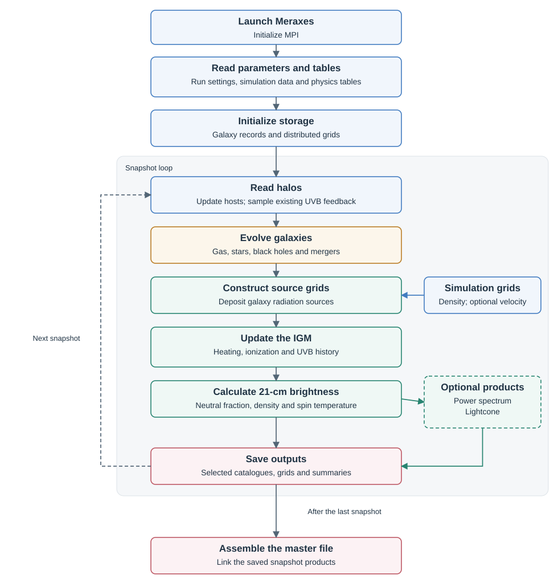

# Execution workflow

Meraxes follows galaxies through successive halo snapshots. Gas, stars and
black holes supply radiation sources; the IGM calculation returns a
photoheating history that regulates later gas infall. Each table below links
a source file to its main routines, the quantities it changes, and the
relevant controls and formulas.

Blue: inputs; gold: galaxies; green: radiation; red: outputs.

## Launch and snapshot loop

| Source file and main routines | What it controls | Result |
|---|---|---|
| [core/meraxes.c](https://github.com/ChangqIngovo/meraxes-devs_qyxnew/blob/faa8aafd49e03a870f3e1ba83c22bdacea58257f/src/core/meraxes.c): `main()` | Initialize MPI, read the parameter-file argument, initialize the model, choose a normal or interactive run, and shut down. | The complete run from launch through cleanup. |
| [core/read_params.c](https://github.com/ChangqIngovo/meraxes-devs_qyxnew/blob/faa8aafd49e03a870f3e1ba83c22bdacea58257f/src/core/read_params.c): `read_parameter_file()` | Register parameter names and types; read user settings, simulation settings and defaults in that priority order; validate combinations and broadcast settings. | Shared [run and model parameters](inputs.md#parameter-files) on every MPI rank. |
| [core/parse_paramfile.c](https://github.com/ChangqIngovo/meraxes-devs_qyxnew/blob/faa8aafd49e03a870f3e1ba83c22bdacea58257f/src/core/parse_paramfile.c): `parse_paramfile()`, `parse_output_snaps()` | Parse `key: value` entries, grouped physics settings and output-snapshot selections. | Parsed entries and the snapshot indices requested by `OutputSnapshots`. |
| [core/init.c](https://github.com/ChangqIngovo/meraxes-devs_qyxnew/blob/faa8aafd49e03a870f3e1ba83c22bdacea58257f/src/core/init.c): `init_meraxes()`, `init_storage()` | Set units and `RandomSeed`; load snapshot times, cooling and stellar-feedback tables; initialize enabled radiation, photometry and enrichment components. | Time arrays, physical tables, halo/grid storage and the HDF5 field definitions. |
| [core/dracarys.c](https://github.com/ChangqIngovo/meraxes-devs_qyxnew/blob/faa8aafd49e03a870f3e1ba83c22bdacea58257f/src/core/dracarys.c): `dracarys()` | Advance snapshots, reconnect descendant hosts, sample stored feedback, call galaxy and enabled IGM evolution, then save selected outputs. | Galaxy and radiation histories through the final requested snapshot; completed output files. |
| [core/read_halos.c](https://github.com/ChangqIngovo/meraxes-devs_qyxnew/blob/faa8aafd49e03a870f3e1ba83c22bdacea58257f/src/core/read_halos.c): `initialize_halo_storage()`, `read_halos()` | Assign complete forests to MPI ranks, allocate halo/group arrays, choose the reader with `TreesID`, and cache snapshots for repeated runs. | Local halos, friends-of-friends groups and index lookups used by `dracarys()`. |
| [core/galaxies.c](https://github.com/ChangqIngovo/meraxes-devs_qyxnew/blob/faa8aafd49e03a870f3e1ba83c22bdacea58257f/src/core/galaxies.c): `create_new_galaxy()`, `connect_galaxy_and_halo()`, `reset_galaxy_properties()` | Create and remove galaxies, connect them to hosts, update types and halo properties, and reset per-snapshot quantities. | The galaxy linked lists, host assignments and persistent histories. |
| [core/read_grids.c](https://github.com/ChangqIngovo/meraxes-devs_qyxnew/blob/faa8aafd49e03a870f3e1ba83c22bdacea58257f/src/core/read_grids.c): `read_grid()`, `smooth_grid()`, `subsample_grid()` | Choose the density/velocity reader with `TreesID`; smooth, downsample and redistribute input grids to `ReionGridDim`; manage cached slabs. | Density and velocity slabs on the radiation mesh; optional density averaging for the metal mesh. |
| [core/save.c](https://github.com/ChangqIngovo/meraxes-devs_qyxnew/blob/faa8aafd49e03a870f3e1ba83c22bdacea58257f/src/core/save.c): `write_snapshot()`, `create_master_file()` | Convert galaxy state to output fields, write selected catalogues and merger indices, accumulate enabled distributions, and assemble external links and metadata. | [Rank catalogues and the master file](outputs.md#files-and-snapshots), including links to separately written grid products. |
| [core/cleanup.c](https://github.com/ChangqIngovo/meraxes-devs_qyxnew/blob/faa8aafd49e03a870f3e1ba83c22bdacea58257f/src/core/cleanup.c): `cleanup()` | Release halo/grid caches, physical tables, random-number state, FFT resources and HDF5 types after the run. | Model resources released before `main()` finalizes MPI. |

Halo and grid reader implementations

| Source file and main routines | What it controls | Result |
|---|---|---|
| [core/read_halos-gbptrees.c](https://github.com/ChangqIngovo/meraxes-devs_qyxnew/blob/faa8aafd49e03a870f3e1ba83c22bdacea58257f/src/core/read_halos-gbptrees.c): `read_trees__gbptrees()` | Read gbpTrees halo histories and catalogue properties; convert virial quantities and retain the rank's forests. | Meraxes halo/group structures and descendant connections. |
| [core/read_halos-velociraptor.c](https://github.com/ChangqIngovo/meraxes-devs_qyxnew/blob/faa8aafd49e03a870f3e1ba83c22bdacea58257f/src/core/read_halos-velociraptor.c): `read_trees__velociraptor()` | Read VELOCIraptor halo histories, including the augmented variant; convert identifiers, host links and virial quantities. | The same halo/group structures consumed by galaxy evolution. |
| [core/read_grids-gbptrees.c](https://github.com/ChangqIngovo/meraxes-devs_qyxnew/blob/faa8aafd49e03a870f3e1ba83c22bdacea58257f/src/core/read_grids-gbptrees.c): `read_grid__gbptrees()` | Read distributed density or velocity data for the gbpTrees backend and apply the shared resampling routines. | The requested local grid slab; `TsVelocityComponent` selects the velocity direction. |
| [core/read_grids-velociraptor.c](https://github.com/ChangqIngovo/meraxes-devs_qyxnew/blob/faa8aafd49e03a870f3e1ba83c22bdacea58257f/src/core/read_grids-velociraptor.c): `read_grid__velociraptor()` | Detect and read supported HDF5 grid inputs for the VELOCIraptor backend, then apply the shared resampling routines. | The requested local density/velocity slab on the radiation mesh. |

Complete halo forests stay on one MPI rank; radiation grids are distributed
in slabs. The loop evolves intermediate snapshots even when they are not
selected for output. `NSteps` must remain `1`.

## Galaxy evolution

Purple arrows show feedback. Gas moves between hot, cold and ejected
reservoirs; stars and black holes grow from that supply, and metals follow
the transfers.

### Galaxy evolution and gas supply

| Source and key routines | What it controls | Main updated quantities | Controls and formulas |
|---|---|---|---|
| [physics/evolve.c](https://github.com/ChangqIngovo/meraxes-devs_qyxnew/blob/faa8aafd49e03a870f3e1ba83c22bdacea58257f/src/physics/evolve.c): `evolve_galaxies()`, `passively_evolve_ghost()` | Orders the galaxy updates; advances orphan merger clocks; continues delayed feedback and queued BH accretion for galaxies with temporarily missing hosts. | Galaxy reservoirs through the routines below; `MergTime`; `Galaxy_Population` when mini-halos are enabled. | `NSteps`, `Flag_IRA`, `ZCrit`; [galaxy prescriptions](formulas/galaxies.md). |
| [core/virial_properties.c](https://github.com/ChangqIngovo/meraxes-devs_qyxnew/blob/faa8aafd49e03a870f3e1ba83c22bdacea58257f/src/core/virial_properties.c): `calculate_Mvir()`, `calculate_Rvir()`, `calculate_Vvir()` | Supplies virial mass, radius, velocity, temperature conversions and cosmological expansion rates to halo and galaxy calculations. | Derived halo properties, spin parameter and Hubble time. | Cosmological parameters, `PartMass`; [virial quantities](formulas/galaxies.md#units-expansion-and-virial-quantities). |
| [core/modifiers.c](https://github.com/ChangqIngovo/meraxes-devs_qyxnew/blob/faa8aafd49e03a870f3e1ba83c22bdacea58257f/src/core/modifiers.c): `read_mass_ratio_modifiers()`, `read_baryon_frac_modifiers()`, `interpolate_modifier()` | Loads mass-dependent correction tables and interpolates the corrections used in halo masses and baryon budgets. | Mass-ratio and baryon-fraction correction factors. | `MassRatioModifier`, `BaryonFracModifier`; [halo corrections](formulas/galaxies.md#units-expansion-and-virial-quantities), [baryon budgets](formulas/galaxies.md#infall-and-baryon-corrections). |
| [core/reionization_modifiers.c](https://github.com/ChangqIngovo/meraxes-devs_qyxnew/blob/faa8aafd49e03a870f3e1ba83c22bdacea58257f/src/core/reionization_modifiers.c): `read_Mcrit_table()` | Reads and broadcasts externally supplied critical-mass histories for uniform feedback. | Per-snapshot `MvirCrit` and optional `MvirCrit_MC` arrays. | `Flag_ReionizationModifier=3`; [critical halo mass](formulas/igm.md#ionization-and-photoheating-feedback). |
| [physics/reionization.c](https://github.com/ChangqIngovo/meraxes-devs_qyxnew/blob/faa8aafd49e03a870f3e1ba83c22bdacea58257f/src/physics/reionization.c): `calculate_Mvir_crit()`, `calculate_Mvir_crit_MC()`, `reionization_modifier()` | Converts UVB history into critical halo masses; chooses local or uniform suppression of infall. The mini-halo calculation includes LW radiation and optional streaming velocities. | `Mvir_crit`, `Mvir_crit_MC` grids; the baryon-retention factor returned to infall. | `Flag_ReionizationModifier`, `ReionUVBFlag`, `Flag_IncludeStreamVel`; [photoheating](formulas/igm.md#ionization-and-photoheating-feedback), [molecular-cooling feedback](formulas/galaxies.md#streaming-velocities-and-molecular-cooling). |
| [physics/infall.c](https://github.com/ChangqIngovo/meraxes-devs_qyxnew/blob/faa8aafd49e03a870f3e1ba83c22bdacea58257f/src/physics/infall.c): `gas_infall()`, `add_infall_to_hot()` | Balances the halo-group baryon budget, transfers satellite hot/ejected gas to the central, and adds fresh gas or strips excess gas. | `HotGas`, `EjectedGas`, their metals and `BaryonFracModifier`. | `BaryonFrac`, reionization and baryon corrections; [infall](formulas/galaxies.md#infall-and-baryon-corrections). |

### Cooling, stars and stellar feedback

| Source and key routines | What it controls | Main updated quantities | Controls and formulas |
|---|---|---|---|
| [core/cooling.c](https://github.com/ChangqIngovo/meraxes-devs_qyxnew/blob/faa8aafd49e03a870f3e1ba83c22bdacea58257f/src/core/cooling.c): `read_cooling_functions()`, `interpolate_cooling_rate()`, `LTE_Mcool()`, `Mcool_SV()` | Supplies tabulated atomic cooling coefficients, molecular cooling rates and the baseline cooling threshold with streaming velocities. | Cooling coefficients and molecular-cooling threshold returned to callers. | `CoolingFuncsDir`; [atomic cooling](formulas/galaxies.md#atomic-cooling), [molecular cooling](formulas/galaxies.md#molecular-cooling), [streaming velocities](formulas/galaxies.md#streaming-velocities-and-molecular-cooling). |
| [physics/cooling.c](https://github.com/ChangqIngovo/meraxes-devs_qyxnew/blob/faa8aafd49e03a870f3e1ba83c22bdacea58257f/src/physics/cooling.c): `gas_cooling()`, `cool_gas_onto_galaxy()` | Calculates the cooling radius and gas supply after radio-mode heating, then transfers gas and metals from the hot to the cold reservoir. | `Rcool`, `Mcool`, `HotGas`, `ColdGas` and their metals. | `MaxCoolingMassFactor`, `Flag_BHFeedback`, `USE_MINI_HALOS`; [cooling](formulas/galaxies.md#cooling-and-reincorporation). |
| [physics/reincorporation.c](https://github.com/ChangqIngovo/meraxes-devs_qyxnew/blob/faa8aafd49e03a870f3e1ba83c22bdacea58257f/src/physics/reincorporation.c): `reincorporate_ejected_gas()` | Returns previously ejected gas to the hot halo on the selected timescale. | `EjectedGas`, `HotGas` and their metals. | `ReincorporationModel`, `ReincorporationEff`; [gas return](formulas/galaxies.md#return-of-ejected-gas). |
| [core/stellar_feedback.c](https://github.com/ChangqIngovo/meraxes-devs_qyxnew/blob/faa8aafd49e03a870f3e1ba83c22bdacea58257f/src/core/stellar_feedback.c): `read_stellar_feedback_tables()`, `compute_stellar_feedback_tables()` | Integrates stellar-population tables over the current snapshot's age intervals and supplies recycling, metal yields and supernova energy. | Age- and metallicity-dependent return, yield and energy tables. | `StellarFeedbackDir`, `N_HISTORY_SNAPS`; [delayed returns](formulas/galaxies.md#delayed-and-instantaneous-returns). |
| [core/PopIII.c](https://github.com/ChangqIngovo/meraxes-devs_qyxnew/blob/faa8aafd49e03a870f3e1ba83c22bdacea58257f/src/core/PopIII.c): `initialize_PopIII()`, `get_StellarAge()`, `CCSN_PopIII_Yield()`, `PISN_PopIII_Yield()` | Sets the Pop. III IMF, stellar lifetimes, ionizing yield, supernova fractions and remnant fractions used by stellar feedback. | IMF-integrated population properties and lifetime-dependent yields. | `USE_MINI_HALOS`, `PopIII_IMF`, `PopIIIAgePrescription`; [stellar fates](formulas/galaxies.md#population-assignment-and-stellar-fates), [lifetimes and feedback](formulas/galaxies.md#stellar-lifetimes-and-feedback). |
| [physics/star_formation.c](https://github.com/ChangqIngovo/meraxes-devs_qyxnew/blob/faa8aafd49e03a870f3e1ba83c22bdacea58257f/src/physics/star_formation.c): `insitu_star_formation()`, `update_reservoirs_from_sf()` | Selects the star-formation law, converts cold gas into stars, records the history and invokes contemporaneous feedback and line emission. | `Sfr`, `StellarMass`, `GrossStellarMass`, `ColdGas`, metals; `H2Mass`, `HIMass` for the molecular-pressure law. | `SfPrescription`, `SfEfficiency`, `SfCriticalSDNorm`, `SfDiskVelOpt`; [star-formation laws](formulas/galaxies.md#star-formation). |
| [physics/supernova_feedback.c](https://github.com/ChangqIngovo/meraxes-devs_qyxnew/blob/faa8aafd49e03a870f3e1ba83c22bdacea58257f/src/physics/supernova_feedback.c): `delayed_supernova_feedback()`, `contemporaneous_supernova_feedback()`, `update_reservoirs_from_sn_feedback()` | Applies stellar recycling, metal production, gas reheating and ejection with an energy budget; also evolves metal bubbles when enabled. | Stellar, cold, hot and ejected masses and metals; Pop. III remnants and `RmetalBubble` when enabled. | `Flag_IRA`, `SnModel`, `SnReheat*`, `SnEjection*`; [stellar returns](formulas/galaxies.md#delayed-and-instantaneous-returns), [reheating/ejection](formulas/galaxies.md#reheating-and-ejection), [metal bubbles](formulas/galaxies.md#metal-bubbles). |

### Mergers, black holes and line emission

| Source and key routines | What it controls | Main updated quantities | Controls and formulas |
|---|---|---|---|
| [physics/mergers.c](https://github.com/ChangqIngovo/meraxes-devs_qyxnew/blob/faa8aafd49e03a870f3e1ba83c22bdacea58257f/src/physics/mergers.c): `calculate_merging_time()`, `merge_with_target()` | Sets merger delays, combines galaxy reservoirs and histories, and triggers eligible starbursts and BH feeding. | Remnant galaxy masses and histories, `MergerBurstMass`, BH accretion reservoir and galaxy `Type`. | `MergerTimeFactor`, `MinMergerRatioForBurst`, `MergerBurstFactor`, `MergerBurstScaling`; [mergers](formulas/galaxies.md#galaxy-mergers). |
| [physics/blackhole_feedback.c](https://github.com/ChangqIngovo/meraxes-devs_qyxnew/blob/faa8aafd49e03a870f3e1ba83c22bdacea58257f/src/physics/blackhole_feedback.c): `radio_mode_BH_heating()`, `previous_merger_driven_BH_growth()`, `calculate_BHemissivity()` | Grows BHs from hot gas and merger-fed cold gas; heats/ejects gas; calculates AGN UV/X-ray emission, duty cycles and obscuration. | `BlackHoleMass`, accretion reservoirs, gas/metals, `EffectiveBHM`, `EffectiveBHAR`, `QuasarLuv`, `QuasarLX` and emissivities. | `Flag_BHFeedback`, `RadioModeEff`, `QuasarModeEff`, `EddingtonRatio`, `Flag_BHARExponentialCut`; [growth/feedback](formulas/galaxies.md#accretion-and-mechanical-feedback), [emission](formulas/galaxies.md#luminosity-and-escaping-photons), [absorption](formulas/galaxies.md#x-ray-absorption). |
| [physics/emission_lines.c](https://github.com/ChangqIngovo/meraxes-devs_qyxnew/blob/faa8aafd49e03a870f3e1ba83c22bdacea58257f/src/physics/emission_lines.c): `set_OIII_coeffs()`, `compute_LOIII()` | Calculates intrinsic [O III] 5008 Å emission from star formation and the gas/disc state; dust attenuation is applied during output. | `LOIII`, `ionization_param`. | Called during star formation; [line-emission model](formulas/galaxies.md#o-iii-5008-å). |

Cooling is calculated before adding current infall and reincorporated gas.
Delayed stellar returns and queued black-hole accretion precede new star
formation; galaxy mergers follow. This order sets which gas and feedback
are available in the current step.

## Radiation and feedback

Galaxy source quantities enter the grid calculation here. The thermal and
ionization solvers update different fields; the resulting UV background and
enrichment history feed back into later galaxy evolution.

| Source and key routines | What it controls | Main updated quantities/products | Controls and formulas |
|---|---|---|---|
| [core/reionization.c](https://github.com/ChangqIngovo/meraxes-devs_qyxnew/blob/faa8aafd49e03a870f3e1ba83c22bdacea58257f/src/core/reionization.c): `update_galaxy_fesc_vals()`, `construct_baryon_grids()`, `assign_Mvir_crit_to_galaxies()` | Evaluate escape fractions and source scatter; deposit galaxy sources into cells; prepare and call the radiation solvers; sample feedback at galaxy positions and save grid products. | Escape-weighted galaxy source budgets; `stars`, `weighted_sfr`, stellar X-ray and BH source grids; galaxy `MvirCrit`; grid files and summary attributes. | `Flag_PatchyReion`, `EscapeFracDependency`, `EscapeFracScatterDex`, `XrayScatterDex`, `Flag_OutputGrids`; [escape fraction](formulas/galaxies.md#ionizing-escape-fraction), [scatter](formulas/galaxies.md#scatter-and-escaped-source-budgets), [source assignment](formulas/igm.md#sources-and-filtering). |
| [core/Stochasticity.c](https://github.com/ChangqIngovo/meraxes-devs_qyxnew/blob/faa8aafd49e03a870f3e1ba83c22bdacea58257f/src/core/Stochasticity.c): `build_no_sfr_tables()`, `apply_no_sfr_treatment()`, `compute_no_sfr_recalibration_factors()` | Construct median SFR–halo-mass relations by galaxy type; accumulate the treated stellar source history; calculate global source-budget corrections for noSFR and scatter treatments. | Internal `SfrNoScatter`, `GrossStellarMassNoScatter`, treated escape-weighted budgets and recalibration factors used during grid deposition. | `USE_STOCHASTICITY`, `Flag_RemoveSFRScatter`, `Flag_SourceRecalibration`; [median relation](formulas/igm.md#median-source-relation), [normalization](formulas/igm.md#source-normalization). |
| [core/ComputeTs.c](https://github.com/ChangqIngovo/meraxes-devs_qyxnew/blob/faa8aafd49e03a870f3e1ba83c22bdacea58257f/src/core/ComputeTs.c): `ComputeTs()` | Filter and integrate past stellar and AGN emission over propagation shells; evolve partial ionization and gas temperature, then calculate spin temperature and optional LW radiation. | `Tk_box`, `x_e_box`, `TS_box`, `JLW_box`; mean heating, ionization and coupling diagnostics. | `Flag_IncludeSpinTemp`, `TsNumFilterSteps`, `Flag_IncludeAGNXray`, `Flag_IncludeLymanWerner`; [thermal evolution](formulas/igm.md#gas-temperature-and-partial-ionization), [spin temperature](formulas/igm.md#ly-coupling-and-spin-temperature). |
| [core/XRayHeatingFunctions.c](https://github.com/ChangqIngovo/meraxes-devs_qyxnew/blob/faa8aafd49e03a870f3e1ba83c22bdacea58257f/src/core/XRayHeatingFunctions.c): `tauX()`, `integrate_over_nu()`, `evolveInt()`, `get_Ts()` | Supply the microphysics used by `ComputeTs()`: absorption, secondary energy deposition, temperature/electron derivatives, collisional coupling and Lyman-alpha coupling. | Attenuation and deposition integrals, evolution derivatives and spin temperature returned to the thermal solver. | `LXrayGal`, `SpecIndexXrayGal`, X-ray energy limits; [X-ray propagation](formulas/igm.md#x-ray-propagation-and-deposition), [coupling](formulas/igm.md#ly-coupling-and-spin-temperature). |
| [core/find_HII_bubbles.c](https://github.com/ChangqIngovo/meraxes-devs_qyxnew/blob/faa8aafd49e03a870f3e1ba83c22bdacea58257f/src/core/find_HII_bubbles.c): `find_HII_bubbles()` | Filter density and escaped photon budgets from large scales down to cells; identify ionized regions, update the UV background, and apply ionized-gas cooling and recombination sinks. | `xH`, `r_bubble`, `Gamma12`, `z_at_ionization`, `temp_kinetic_all_gas`, `N_rec`, `J_21_at_ionization`. | `ReionFilterType`, `ReionRBubbleMax`, `Flag_IncludeRecombinations`, `Flag_TemperatureDependentRec`; [ionization](formulas/igm.md#ionization-and-photoheating-feedback), [photoionized gas](formulas/igm.md#photoionized-gas-and-molecular-cooling-feedback). |
| [core/recombinations.c](https://github.com/ChangqIngovo/meraxes-devs_qyxnew/blob/faa8aafd49e03a870f3e1ba83c22bdacea58257f/src/core/recombinations.c): `init_MHR()`, `splined_recombination()`, `Gamma_SS()` | Integrate a subgrid density distribution with self-shielding; tabulate and interpolate the recombination rate and neutral gas surviving within ionized regions. | Rates supplied to `find_HII_bubbles()`; `residual_xH` and `clumping_factor`, with the rate accumulated into `N_rec`. | `Flag_IncludeRecombinations`; temperature selection through `Flag_TemperatureDependentRec`; [recombination and self-shielding](formulas/igm.md#recombination-and-self-shielding). |
| [core/metal_evo.c](https://github.com/ChangqIngovo/meraxes-devs_qyxnew/blob/faa8aafd49e03a870f3e1ba83c22bdacea58257f/src/core/metal_evo.c): `construct_metal_grids()`, `assign_probability_to_galaxies()`, `save_metal_input_grids()` | Deposit enrichment-bubble volumes and ejected metals; assign local enrichment probability and IGM material to galaxies; save the metal grids. | Saved `Probability_metals`, `Average Radius`, `Max Radius`, `N_bubbles`, gas/metal grids; galaxy `Metal_Probability`, `Metals_IGM`, `Gas_IGM`. | `USE_MINI_HALOS`, `Flag_IncludeMetalEvo`, `MetalGridDim`; [metal bubbles](formulas/galaxies.md#metal-bubbles). |

For example, `EscapeFracDependency` selects how galaxies supply escaped
ionizing photons in `core/reionization.c`. Their deposited source grids enter
`find_HII_bubbles.c`, which calculates `xH`; `BrightnessTemperature.c` then uses
`xH` to calculate `delta_T`.

With `Flag_IncludeSpinTemp=1`, `call_ComputeTs()` prepares the grids and runs
the thermal solver before `call_find_HII_bubbles()`. Otherwise, the ionization
wrapper prepares the grids, and the brightness calculation uses saturated
spin temperature. At the start of the next snapshot,
`physics/reionization.c` converts the retained UVB history into `Mvir_crit`;
`core/reionization.c` samples that grid at galaxy positions before gas infall.

## Observables and saved products

| Source and key routines | What it controls | Main updated quantities/products | Controls and formulas |
|---|---|---|---|
| [core/BrightnessTemperature.c](https://github.com/ChangqIngovo/meraxes-devs_qyxnew/blob/faa8aafd49e03a870f3e1ba83c22bdacea58257f/src/core/BrightnessTemperature.c): `ComputeBrightnessTemperatureBox()` | Combine density, neutral fraction and spin temperature into the 21-cm signal; optionally apply velocity gradients and line-of-sight remapping. | `delta_T`, `volume_ave_Tb`; the optional no-Pop-III diagnostic channel. | `Flag_Compute21cmBrightTemp`, `Flag_IncludeSpinTemp`, `Flag_IncludePecVelsFor21cm`; [21-cm brightness](formulas/igm.md#21-cm-brightness-and-velocities). |
| [core/ComputePowerSpectrum.c](https://github.com/ChangqIngovo/meraxes-devs_qyxnew/blob/faa8aafd49e03a870f3e1ba83c22bdacea58257f/src/core/ComputePowerSpectrum.c): `Initialise_PowerSpectrum()`, `Compute_PS()` | Fourier-transform brightness fluctuations, bin modes by wavenumber and calculate dimensional power and mode-count uncertainty. | `k_bins`, `PS_data`, `PS_error`; optional `PSII_data` and `PSII_error`. | `Flag_ComputePS`, with brightness enabled; [power spectrum](formulas/igm.md#global-quantities-power-spectra-and-lightcones). |
| [core/ConstructLightcone.c](https://github.com/ChangqIngovo/meraxes-devs_qyxnew/blob/faa8aafd49e03a870f3e1ba83c22bdacea58257f/src/core/ConstructLightcone.c): `Initialise_ConstructLightcone()`, `ConstructLightcone()` | Place brightness slices along comoving distance, interpolating between adjacent snapshots in cosmic time and repeating the periodic box along the sightline. | `LightconeBox`, `lightcone-z`; retained previous-snapshot brightness for the next interpolation. | `Flag_ConstructLightcone`, `EndSnapshotLightcone`; [lightcone construction](formulas/igm.md#global-quantities-power-spectra-and-lightcones). |
| [core/magnitudes.c](https://github.com/ChangqIngovo/meraxes-devs_qyxnew/blob/faa8aafd49e03a870f3e1ba83c22bdacea58257f/src/core/magnitudes.c): `init_magnitudes()`, `add_luminosities()`, `get_output_magnitudes()` | Convolve new stellar populations with age/metallicity templates and bandpasses; carry fluxes through mergers; apply birth-cloud and diffuse-ISM dust attenuation. | Galaxy `Mags`, `DustyMags`, and optional `MagsIII`. | `CALC_MAGS`, `RestBands`, `BetaBands`, `DustTauUVISM`, `DustTauUVBC`; [continuum and dust](formulas/galaxies.md#continuum-filters-and-dust). |
| [core/dist_func.c](https://github.com/ChangqIngovo/meraxes-devs_qyxnew/blob/faa8aafd49e03a870f3e1ba83c22bdacea58257f/src/core/dist_func.c): `df_init()`, `df_mpi_reduce()`, `df_write_hdf5()` | Provide common binning, MPI reduction and HDF5 output for counts accumulated in `save.c`; normalize by volume and bin width and calculate uncertainties. | Three-column mass/luminosity functions: bin centre, number density and uncertainty; e.g. `HMF`, `SMF`, `UVLF`, `QuasarLF`. | Corresponding `Flag_OutputHMF`, `Flag_OutputSMF`, luminosity-function flags; [distribution functions](formulas/numerics.md#distribution-functions). |

The radiation, brightness, power-spectrum and lightcone products are linked
under `Snap/Grids`. Galaxy magnitudes are fields in
`Snap/CoreN/Galaxies`; distribution tables are linked directly under
`Snap`. The [output reference](outputs.md) gives the complete dataset lists
and saving conditions.

